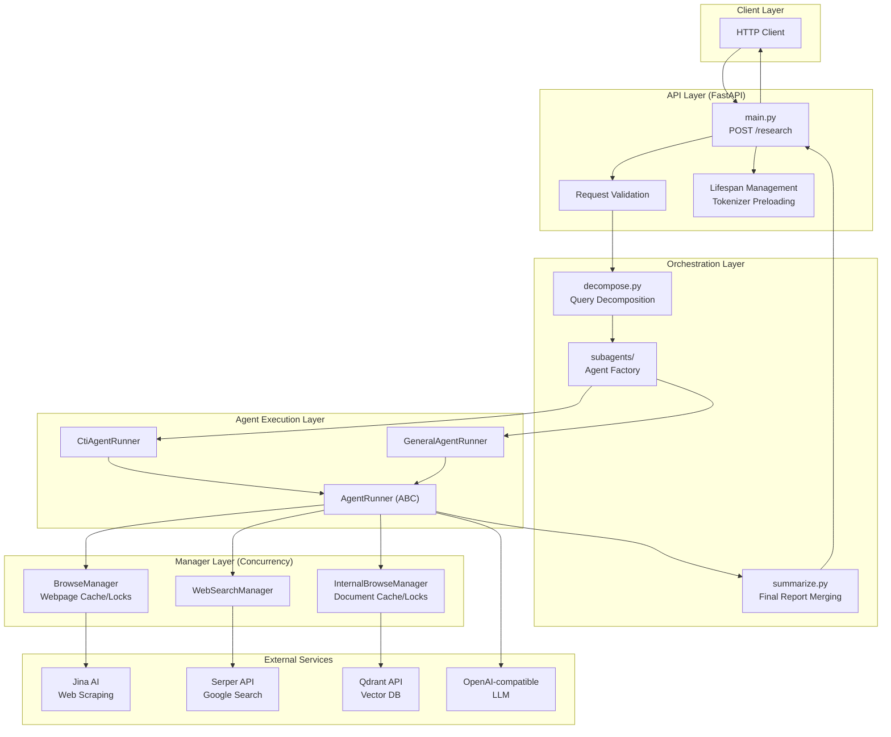
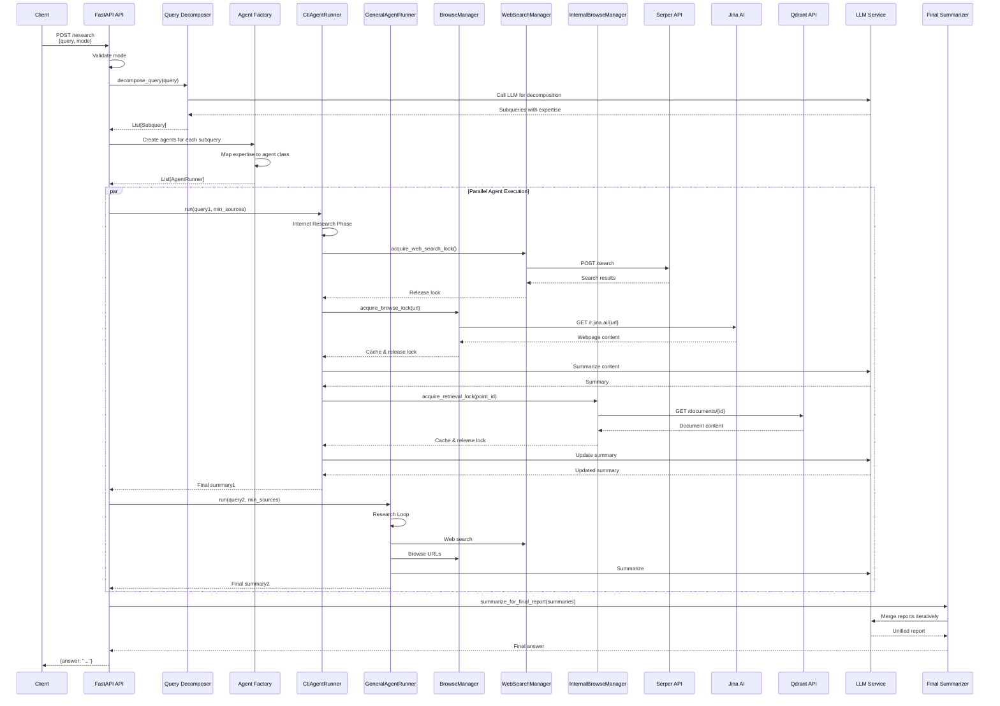
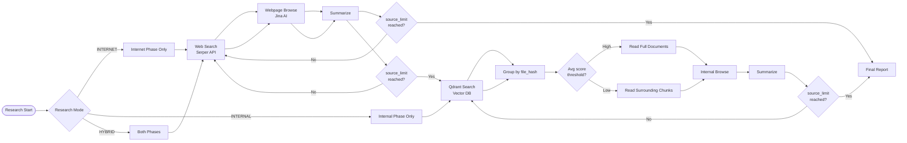
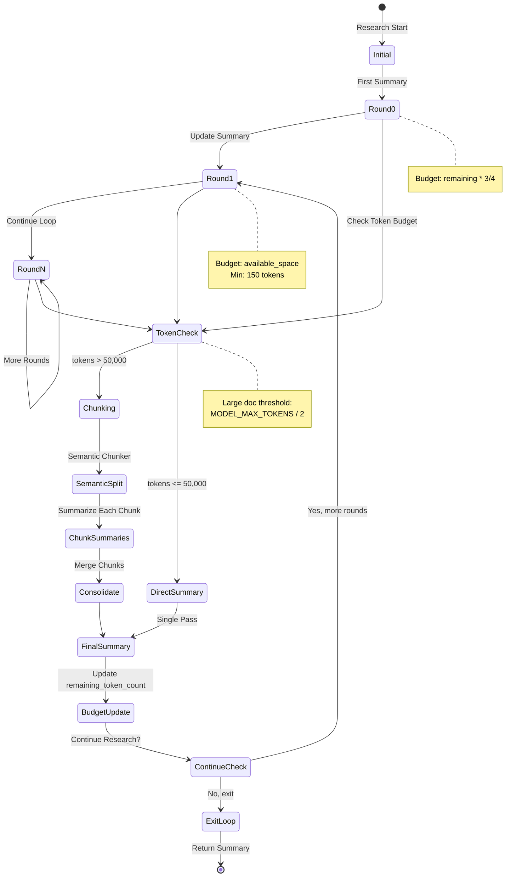
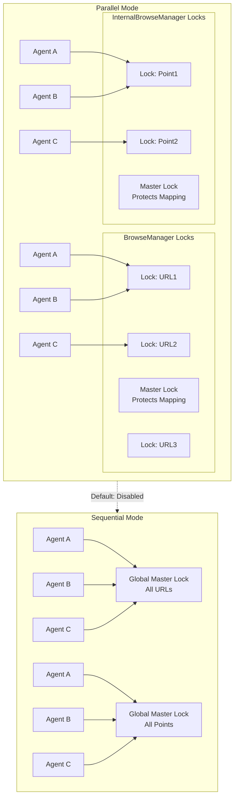

# Geo DeepResearch - Architecture Overview

## System Architecture

Geo DeepResearch is a multi-agent deep research system that decomposes complex queries into specialized subtasks, each handled by domain-expert subagents. The system supports hybrid research across both internet sources and internal document repositories.

## Architecture Diagrams

### High-Level System Architecture



### Component Interaction Flow



### Research Mode Flow



### Token Budgeting State Machine



### Concurrency Control Architecture



### Data Flow Architecture

```mermaid
flowchart LR
    subgraph Ingestion["Document Ingestion Pipeline"]
        DocDrop[Document Dropped] --> Detect[Cron Detects]
        Detect --> Extract[Extract Text<br/>pdfplumber, python-docx]
        Extract --> Split[Split into Chunks<br/>~500 chars]
        Split --> Embed[Generate Embeddings<br/>Dense + Sparse]
        Embed --> Store[Store in Qdrant<br/>file_hash, chunk_index]
    end
    
    subgraph Query["Query Pipeline"]
        QSearch[Agent Search Query] --> QdrantAPI[Qdrant API<br/>/query]
        QdrantAPI --> HybridSearch[Hybrid Search<br/>Dense + Sparse + RRF]
        HybridSearch --> Results[Scored Results]
        Results --> Group[Group by file_hash]
        Group --> Strategy[Strategy Selection]
        Strategy --> Retrieve[Retrieve Documents]
        Retrieve --> Summarize[Summarize]
    end
    
    subgraph Web["Web Research Pipeline"]
        WSearch[Agent Search Query] --> SerperAPI[Serper API]
        SerperAPI --> WResults[Search Results]
        WResults --> SelectURL[LLM Selects URLs]
        SelectURL --> JinaAPI[Jina AI API]
        JinaAPI --> WContent[Webpage Content]
        WContent --> WSummarize[Summarize]
    end
    
    Ingestion --> Query
    Query --> FinalMerge
    Web --> FinalMerge
    
    subgraph FinalMerge["Final Report Generation"]
        FinalMerge --> Merge[Iterative Merging]
        Merge --> Dedupe[Deduplicate Citations]
        Dedupe --> Reindex[Re-index Citations]
        Reindex --> Output[Final Report]
    end
```

## High-Level Architecture (Text Diagram)

```
┌─────────────────────────────────────────────────────────────────────────┐
│                         API Layer (FastAPI)                             │
│                         main.py                                         │
│  ┌──────────────────────────────────────────────────────────────────┐   │
│  │  POST /research                                                  │   │
│  │  - Request validation (ResearchRequestBody)                      │   │
│  │  - Mode validation (internet/internal/hybrid)                    │   │
│  │  - Lifespan management (tokenizer preloading)                    │   │
│  └──────────────────────────────────────────────────────────────────┘   │
└─────────────────────────────────────────────────────────────────────────┘
                                    ↓
┌─────────────────────────────────────────────────────────────────────────┐
│                      Orchestration Layer                                │
│  ┌──────────────────┐  ┌──────────────────┐  ┌──────────────────┐       │
│  │  decompose.py    │  │  summarize.py    │  │  subagents/      │       │
│  │  - Query         │  │  - Final report  │  │  - AgentRunner   │       │
│  │    decomposition │  │    merging       │  │  - run_agents()  │       │
│  │  - Expertise     │  │  - Citation      │  │  - create_       │       │
│  │    tagging       │  │    deduplication │  │    research_     │       │
│  │                  │  │                  │  │    subagent()    │       │
│  └──────────────────┘  └──────────────────┘  └──────────────────┘       │
└─────────────────────────────────────────────────────────────────────────┘
                                    ↓
┌─────────────────────────────────────────────────────────────────────────┐
│                      Agent Execution Layer                              │
│  ┌─────────────────────────────────────────────────────────────────┐    │
│  │                    AgentRunner (ABC)                            │    │
│  │  ┌─────────────────┐  ┌─────────────────┐  ┌─────────────────┐  │    │
│  │  │ _run_internet_  │  │ _run_internal_  │  │ chunk_and_      │  │    │
│  │  │ research()      │  │ research()      │  │ summarize()     │  │    │
│  │  └─────────────────┘  └─────────────────┘  └─────────────────┘  │    │
│  │  - Token budgeting                                              │    │
│  │  - Retry logic with exponential backoff                         │    │
│  │  - Tool calling (web_search, webpage_browse,                    │    │
│  │    internal_search, internal_browse)                            │    │
│  └─────────────────────────────────────────────────────────────────┘    │
│  ┌─────────────────┐  ┌─────────────────┐                               │
│  │ CtiAgentRunner  │  │ GeneralAgent    │                               │
│  │ - Priority:     │  │ - No priority   │                               │
│  │   cloud.google  │  │   sources       │                               │
│  │ - source_limit: │  │ - source_limit: │                               │
│  │   5             │  │   6             │                               │
│  └─────────────────┘  └─────────────────┘                               │
└─────────────────────────────────────────────────────────────────────────┘
                                    ↓
┌─────────────────────────────────────────────────────────────────────────┐
│                      Manager Layer (Concurrency Control)                │
│  ┌──────────────────┐  ┌──────────────────┐  ┌──────────────────┐       │
│  │ BrowseManager    │  │ WebSearch        │  │ InternalBrowse   │       │
│  │ - Webpage cache  │  │ Manager          │  │ Manager          │       │
│  │ - Per-URL locks  │  │ - Search lock    │  │ - Document cache │       │
│  │ - Cache          │  │                  │  │ - Per-point locks│       │
│  │   invalidation   │  │                  │  │                  │       │
│  │   (60s timeout)  │  │                  │  │                  │       │
│  └──────────────────┘  └──────────────────┘  └──────────────────┘       │
└─────────────────────────────────────────────────────────────────────────┘
                                    ↓
┌─────────────────────────────────────────────────────────────────────────┐
│                      External Services                                  │
│  ┌──────────────┐  ┌──────────────┐  ┌──────────────┐  ┌────────────┐   │
│  │ Serper API   │  │ Jina AI      │  │ Qdrant API   │  │ OpenAI-    │   │
│  │ (Google      │  │ (Webpage     │  │ (Internal    │  │ compatible │   │
│  │  Search)     │  │  scraping)   │  │  docs)       │  │  LLMs      │   │
│  └──────────────┘  └──────────────┘  └──────────────┘  └────────────┘   │
└─────────────────────────────────────────────────────────────────────────┘
```

## Core Components

### 1. API Layer (`main.py`)

**Responsibilities:**
- HTTP request/response handling via FastAPI
- Request validation (query, mode)
- Application lifecycle management (tokenizer preloading)
- Orchestration of decomposition → agent execution → summarization pipeline

**Key Classes:**
- `ResearchRequestBody`: Pydantic model for request validation
- `lifespan`: Async context manager for startup/shutdown hooks

### 2. Query Decomposition (`decompose.py`)

**Responsibilities:**
- Break complex queries into subqueries
- Tag each subquery with expertise category

**Flow:**
```
Input Query → LLM (decomposer_instructions) → DecomposerOutput
                                              {
                                                subqueries: [
                                                  {expertise: "cti", query: "..."},
                                                  {expertise: "finance", query: "..."},
                                                  {expertise: "general", query: "..."}
                                                ]
                                              }
```

**Expertise Categories:**
- `cti`: Cyber Threat Intelligence
- `finance`: Market data, stocks, commodities, cryptocurrency
- `general`: Fallback for uncategorized queries

### 3. Agent System (`subagents/`)

#### AgentRunner (Base Class)

Abstract base class providing:
- **Token Management**: Dynamic budgeting based on remaining tokens
- **Chunking Strategy**: Semantic chunking for large documents
- **Tool Registration**: Introspection-based tool schema generation
- **Retry Logic**: Exponential backoff with jitter for API calls
- **Research Modes**: INTERNET, INTERNAL, HYBRID

**Key Methods:**
```python
# Abstract methods (must be implemented by subclasses)
priority_sources() -> dict[str, str]      # Priority source domains
source_limit() -> int                      # Max sources to collect

# Concrete methods
_run_internet_research()                   # Web search + browsing
_run_internal_research()                   # Qdrant search + retrieval
chunk_and_summarize()                      # Semantic chunking + summarization
webpage_browse()                           # Jina AI scraping with caching
internal_browse()                          # Qdrant document retrieval
```

#### Specialized Agents

| Agent | Priority Sources | Source Limit | Use Case |
|-------|-----------------|--------------|----------|
| `CtiAgentRunner` | `{"IOCs": "cloud.google.com"}` | 5 | Cyber threat intelligence |
| `GeneralAgentRunner` | `{}` (none) | 6 | General research |

### 4. Manager Layer (Concurrency Control)

#### BrowseManager (Web Pages)

**Purpose:** Prevent duplicate webpage browsing across parallel agents

**Features:**
- **Content Cache**: Stores webpage content with 60s invalidation timeout
- **Locking Strategy**:
  - `parallel_mode=false`: Global master lock (sequential browsing)
  - `parallel_mode=true`: Per-URL locks (concurrent browsing of different URLs)
- **Lock Timeout**: 60s to prevent deadlocks
- **Retry Logic**: Wait for lock release with timeout

**Flow:**
```
Agent wants to browse URL X
    ↓
Check cache for URL X
    ↓
Cache miss → Acquire lock (master or per-URL)
    ↓
Browse via Jina AI (r.jina.ai/URL)
    ↓
Store in cache → Release lock
```

#### WebSearchManager

**Purpose:** Prevent duplicate web searches

**Features:**
- Simple master lock for search operations
- Parallel mode bypasses locking

#### InternalBrowseManager

**Purpose:** Prevent duplicate internal document retrieval

**Features:**
- **Content Cache**: Stores document content by point ID
- **Locking Strategy**: Same as BrowseManager but for Qdrant point IDs
- **Lock Timeout**: 60s

### 5. Tokenization (`tokenize.py`, `tokenizer_manager.py`)

**Purpose:** Accurate token counting for budget management

**Implementation:**
- Uses HuggingFace transformers tokenizer (GLM-4.7-Flash)
- Global singleton pattern to prevent redundant loading
- Preloaded at application startup via lifespan hook

**Usage:**
```python
from geo_deepresearch.tokenize import count_tokens

token_count = count_tokens(text)  # Accurate token estimation
```

### 6. LLM Utilities (`util/llm.py`)

**Purpose:** Standardized LLM interface with retry logic

**Features:**
- **Rate Limit Handling**: Exponential backoff (2^attempt + jitter)
- **Tool Introspection**: Automatic schema generation from Python functions
- **Structured Output**: Pydantic model parsing via `.parse()`
- **Datetime Injection**: Automatic current datetime in system prompts
- **Langfuse Integration**: Observability via `LangfuseAsyncOpenAI`

**Key Function:**
```python
async def call_llm(
    client: AsyncOpenAI,
    model: str,
    system: str,
    user: str | list[str],
    tools: Optional[List[Callable]] = None,
    force_tool: Optional[Callable] = None,
    output_schema: Optional[type[BaseModel]] = None,
) -> ParsedChatCompletionMessage
```

### 7. Temporal Awareness (`tools/time.py`)

**Purpose:** Provide temporal context to all LLM calls for time-sensitive reasoning

**Implementation:**
- The `append_current_datetime()` function appends the current datetime string to system prompts
- Automatically applied in `call_llm()` before constructing the messages array
- Ensures the model has explicit context about when research is being conducted

**Usage:**
```python
from geo_deepresearch.tools.time import append_current_datetime

messages = [
    {"role": "system", "content": append_current_datetime(system_prompt)},
    {"role": "user", "content": user_message}
]
```

**Benefits:**
- Critical for distinguishing historical vs. current information
- Improves accuracy on time-sensitive queries
- Applied consistently across all LLM invocations (decomposition, research loops, tool calling, summarization)

### 8. Constants & Configuration

**constants.py:**
```python
MODEL_MAX_TOKENS = int(os.environ.get("DEEP_RESEARCH_MODEL_MAX_TOKENS", 100000))
```

**config.py:**
```python
class Config:
    parallel_mode_enabled = os.environ.get("PARALLEL_MODE", "").lower() == "true"
```

## Data Flow

### Request Flow
```
1. POST /research {query, mode}
        ↓
2. Validate mode → ResearchMode enum
        ↓
3. Decompose query → List[Subquery]
        ↓
4. Create agents → List[AgentRunner]
        ↓
5. Run agents (parallel/sequential)
        ↓
6. Merge summaries → Final report
        ↓
7. Return JSON {answer: "..."}
```

### Agent Research Flow
```
For each agent:
    INTERNET PHASE (if mode=internet/hybrid):
        1. Check priority sources queue
        2. Web search (Serper API)
        3. Select URLs → Browse (Jina AI)
        4. Summarize → Update summary
        5. Repeat until source_limit reached
    
    INTERNAL PHASE (if mode=internal/hybrid):
        1. Search Qdrant (hybrid dense+sparse)
        2. Group results by file_hash
        3. Strategy selection:
           - High confidence (avg score > 0.4): Full docs
           - Low confidence: Surrounding chunks
        4. Retrieve documents → Summarize
        5. Repeat until no unique files or source_limit
```

## Token Budgeting Strategy

### Dynamic Budget Calculation

```python
# Initial summary (round 0)
summarize_max_tokens = remaining_token_count * 3/4

# Subsequent rounds
available_space = remaining_token_count - current_summary_size - buffer_tokens
summarize_max_tokens = max(available_space, MIN_SUMMARY_ROOM)

# Constants
MIN_SUMMARY_ROOM = 150 tokens
buffer_tokens = 200 words ≈ 260 tokens
```

### Chunking Thresholds

| Document Size | Strategy |
|--------------|----------|
| < 50,000 tokens | Direct summarization |
| ≥ 50,000 tokens | Semantic chunking (7000 tokens/chunk, 500 overlap) |

### Model Limits

- **Hard Limit**: `MODEL_MAX_TOKENS` (default: 100,000)
- **Summary Limit**: 80% of `MODEL_MAX_TOKENS`
- **Chunk Size**: 75% of `MODEL_MAX_TOKENS`

## Research Modes

### INTERNET Mode
- Web search via Serper API
- Webpage browsing via Jina AI
- No internal document access

### INTERNAL Mode
- Qdrant vector database search
- Document retrieval by point ID
- No internet access

### HYBRID Mode (Default)
- Internet research first
- Internal research second
- Comprehensive coverage

## Environment Variables

| Variable | Description | Default |
|----------|-------------|---------|
| `DEEP_RESEARCH_API_KEY` | OpenAI-compatible API key | - |
| `DEEP_RESEARCH_BASE_URL` | OpenAI-compatible base URL | - |
| `DEEP_RESEARCH_MODEL` | Model name | `z-ai/glm-4.7-flash` |
| `DEEP_RESEARCH_MODEL_MAX_TOKENS` | Model context window | `100000` |
| `JINA_API_KEY` | Jina AI API key | - |
| `SERPER_API_KEY` | Serper API key | - |
| `QDRANT_API_URL` | Qdrant API server URL | `http://qdrant_api_server:8000` |
| `PARALLEL_MODE` | Enable parallel agent execution | `false` |
| `TOKENIZER_DIR` | Tokenizer directory | `../tokenizer` |
| `RESEARCH_MODE` | Default research mode | `hybrid` |

## Directory Structure

```
src/geo_deepresearch/
├── main.py                    # FastAPI entrypoint
├── decompose.py               # Query decomposition
├── summarize.py               # Final report merging
├── tokenize.py                # Token counting utilities
├── tokenizer_manager.py       # Tokenizer singleton
├── constants.py               # Global constants
├── config.py                  # Configuration management
├── browse_manager.py          # Webpage caching/locking
├── web_search_manager.py      # Search locking
├── internal_browse_manager.py # Internal doc caching/locking
├── subagents/
│   ├── __init__.py            # Agent factory
│   ├── agent_runner.py        # Base agent class
│   ├── general_subagent.py    # General purpose agent
│   └── cti_subagent.py        # CTI specialist agent
├── util/
│   ├── llm.py                 # LLM client utilities
│   ├── tools.py               # Tool schema generation
│   └── logging.py             # Logging setup
└── tools/
    └── time.py                # Datetime utilities
```

## Design Patterns

### 1. Strategy Pattern
Different research modes (INTERNET, INTERNAL, HYBRID) implemented as conditional strategy selection in `AgentRunner.run()`.

### 2. Factory Pattern
`create_research_subagent()` creates appropriate agent instances based on expertise category.

### 3. Singleton Pattern
- `BrowseManager`: Shared instance across all agents
- `InternalBrowseManager`: Shared instance across all agents
- `Tokenizer`: Cached in global dictionary

### 4. Template Method Pattern
`AgentRunner` defines the research loop skeleton, subclasses override `priority_sources()` and `source_limit()`.

### 5. Context Manager Pattern
Async context managers for lock acquisition:
```python
async with browse_manager.acquire_browse_lock(url):
    # Browse webpage
```

## Observability

### Langfuse Integration
All LLM calls are traced via `LangfuseAsyncOpenAI` client:
- Automatic trace/span creation
- Token usage tracking
- Latency monitoring

### Logging
Structured logging via custom logger:
- Debug: Tool calls, token budgets, cache hits
- Info: Research progress, summary updates
- Warning: Retry attempts, rate limits
- Error: API failures, validation errors

## Security Considerations

1. **API Key Management**: All sensitive keys via environment variables
2. **No External Knowledge Injection**: Grounding instructions prevent hallucination
3. **Citation Enforcement**: All statements must link to sources
4. **Timeout Protection**: 60s lock timeouts prevent deadlocks
5. **Rate Limit Handling**: Exponential backoff prevents API abuse
