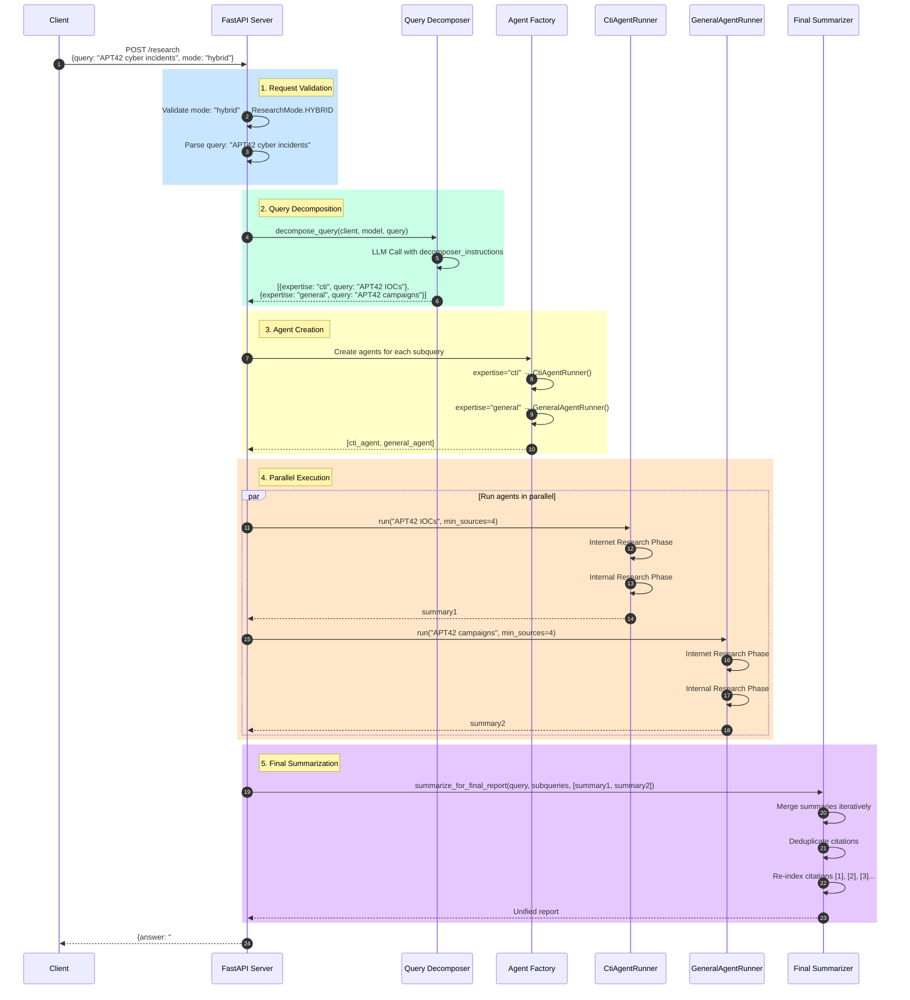
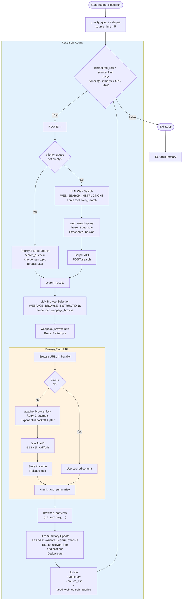
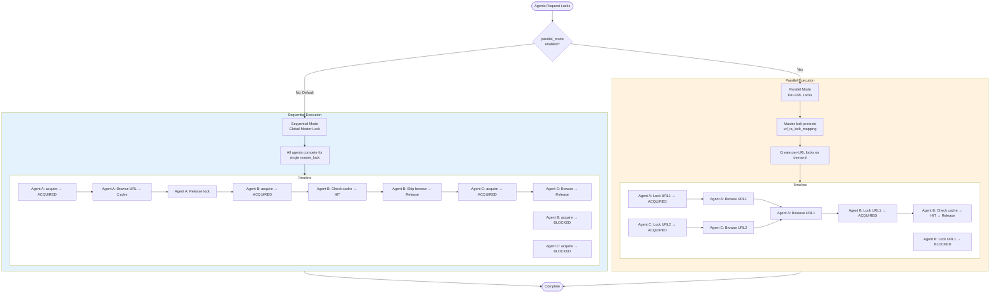
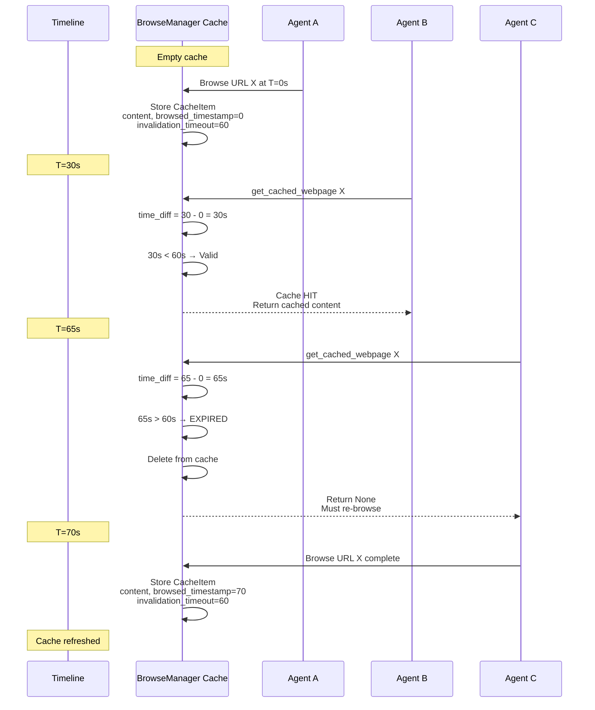
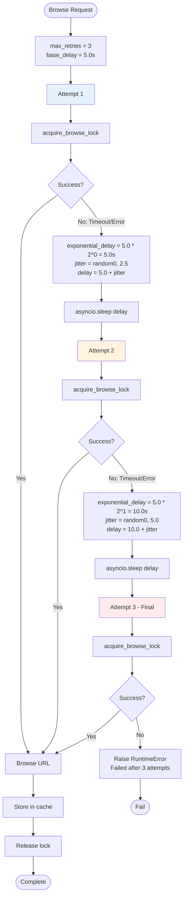
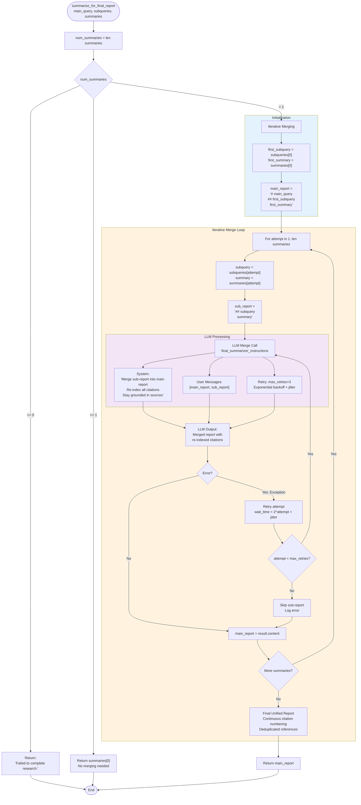
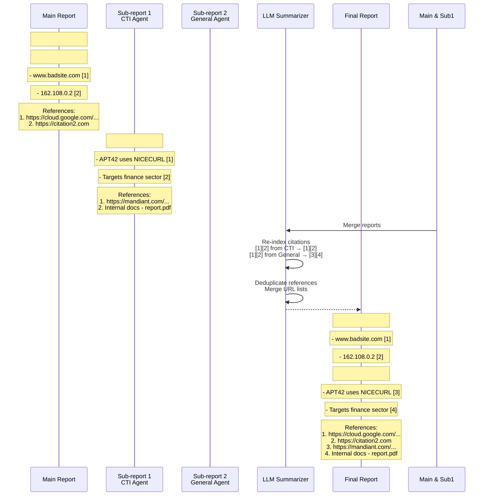

# Geo DeepResearch - Flow Overview

This document provides a detailed walkthrough of the deep research flow, from API request to final report generation.

## Table of Contents

1. [Complete Research Flow](#1-complete-research-flow)
2. [Query Decomposition Flow](#2-query-decomposition-flow)
3. [Internet Research Flow](#3-internet-research-flow)
4. [Internal Research Flow](#4-internal-research-flow)
5. [Chunking & Summarization Flow](#5-chunking--summarization-flow)
6. [Concurrency Control Flow](#6-concurrency-control-flow)
7. [Final Report Merging Flow](#7-final-report-merging-flow)

---

## 1. Complete Research Flow

### End-to-End Sequence (Mermaid)



### End-to-End Sequence (Text Diagram)

```
┌─────────────┐
│   Client    │
└──────┬──────┘
       │ POST /research
       │ {query: "APT42 cyber incidents", mode: "hybrid"}
       ▼
┌─────────────────────────────────────────────────────────────────┐
│  FastAPI Server (main.py)                                       │
│  ┌───────────────────────────────────────────────────────────┐  │
│  │ 1. Request Validation                                     │  │
│  │    - Validate mode: "hybrid" → ResearchMode.HYBRID        │  │
│  │    - Parse query: "APT42 cyber incidents"                 │  │
│  └───────────────────────────────────────────────────────────┘  │
│  ┌───────────────────────────────────────────────────────────┐  │
│  │ 2. Query Decomposition                                    │  │
│  │    decompose_query(client, model, query)                  │  │
│  │    → [{"expertise": "cti", "query": "APT42 IOCs"},        │  │
│  │       {"expertise": "general", "query": "APT42 campaigns"}]│  │
│  └───────────────────────────────────────────────────────────┘  │
│  ┌───────────────────────────────────────────────────────────┐  │
│  │ 3. Agent Creation                                         │  │
│  │    for subquery in subqueries:                            │  │
│  │      - expertise="cti" → CtiAgentRunner()                 │  │
│  │      - expertise="general" → GeneralAgentRunner()         │  │
│  └───────────────────────────────────────────────────────────┘  │
│  ┌───────────────────────────────────────────────────────────┐  │
│  │ 4. Parallel Execution                                     │  │
│  │    results = await run_agents(queries, agents,            │  │
│  │                               min_sources=4)              │  │
│  │    → [summary1, summary2, ...]                            │  │
│  └───────────────────────────────────────────────────────────┘  │
│  ┌───────────────────────────────────────────────────────────┐  │
│  │ 5. Final Summarization                                    │  │
│  │    summarize_for_final_report(query, subqueries, results) │  │
│  │    → Unified report with deduplicated citations           │  │
│  └───────────────────────────────────────────────────────────┘  │
└─────────────────────────────────────────────────────────────────┘
       │
       │ {"answer": "### APT42 cyber incidents\n\n..."}
       ▼
┌─────────────┐
│   Client    │
└─────────────┘
```

### Timeline

| Step | Component | Duration (est.) | Parallel? |
|------|-----------|-----------------|-----------|
| 1. Request Validation | FastAPI | <10ms | No |
| 2. Query Decomposition | LLM | 2-5s | No |
| 3. Agent Creation | Factory | <10ms | No |
| 4. Agent Execution | AgentRunner | 30-120s | **Yes** |
| 5. Final Summarization | LLM | 5-15s | No |
| **Total** | | **~40s-2.5min** | |

---

## 2. Query Decomposition Flow

### Detailed Flow (Mermaid)

```mermaid
flowchart TD
    A[decompose_query<br/>client, model, query] --> B[LLM Call<br/>call_llm]
    
    subgraph LLM["LLM Processing"]
        B --> C[System Prompt:<br/>decomposer_instructions]
        B --> D[User Prompt:<br/>query]
        B --> E[Output Schema:<br/>DecomposerOutput]
    end
    
    C --> F[LLM Response<br/>{"subqueries": [...]}]
    D --> F
    E --> F
    
    F --> G[Parse Response<br/>message.parsed]
    
    G --> H[DecomposerOutput Object<br/>subqueries: [<br/>  {expertise: "cti", query: "..."},<br/>  {expertise: "general", query: "..."}<br/>]]
    
    H --> I[Agent Factory<br/>create_research_subagent]
    
    subgraph Factory["Agent Creation Loop"]
        I --> J{expertise == "cti"?}
        J -->|Yes| K[CtiAgentRunner<br/>mode=research_mode]
        J -->|No| L{expertise == "finance"?}
        L -->|Yes| M[FinanceAgentRunner<br/>mode=research_mode]
        L -->|No| N[GeneralAgentRunner<br/>mode=research_mode]
    end
    
    K --> O[agents = [cti_agent, ...]]
    M --> O
    N --> O
    
    style LLM fill:#e3f2fd
    style Factory fill:#fff3e0
```

### Detailed Flow (Text Diagram)

```
┌─────────────────────────────────────────────────────────────────┐
│  decompose_query(client, model, query)                          │
└─────────────────────────────────────────────────────────────────┘
       │
       │ System Prompt: decomposer_instructions
       │ User Prompt: query
       ▼
┌─────────────────────────────────────────────────────────────────┐
│  LLM Call (call_llm)                                            │
│  System: "Role: You are to decompose query into parts..."       │
│  User: "APT42 cyber incidents"                                  │
│  Output Schema: DecomposerOutput                                │
└─────────────────────────────────────────────────────────────────┘
       │
       │ Response: {"subqueries": [...]}
       ▼
┌─────────────────────────────────────────────────────────────────┐
│  Parse Response                                                 │
│  message.parsed → DecomposerOutput                              │
│  {                                                              │
│    subqueries: [                                                │
│      {expertise: "cti", query: "APT42 IOCs and malware"},       │
│      {expertise: "general", query: "APT42 recent campaigns"}    │
│    ]                                                            │
│  }                                                              │
└─────────────────────────────────────────────────────────────────┘
       │
       │ Return DecomposerOutput
       ▼
┌─────────────────────────────────────────────────────────────────┐
│  Agent Factory (create_research_subagent)                       │
│  for subquery in subqueries:                                    │
│    if expertise == "cti":                                       │
│      agent = CtiAgentRunner(mode=research_mode)                 │
│    else:                                                        │
│      agent = GeneralAgentRunner(mode=research_mode)             │
│  agents = [cti_agent, general_agent]                            │
└─────────────────────────────────────────────────────────────────┘
```

### Example Decomposition

**Input Query:**
```
"Research APT42 cyber incidents and their financial impact on victims"
```

**Output Subqueries:**
```json
{
  "subqueries": [
    {
      "expertise": "cti",
      "query": "APT42 IOCs and attack techniques"
    },
    {
      "expertise": "cti", 
      "query": "APT42 malware and backdoors used"
    },
    {
      "expertise": "finance",
      "query": "Financial losses from APT42 attacks"
    },
    {
      "expertise": "general",
      "query": "APT42 recent campaigns and targets"
    }
  ]
}
```

---

## 3. Internet Research Flow

### Phase A: Internet Research (`_run_internet_research`) - Mermaid



### Phase A: Internet Research (`_run_internet_research`) - Text Diagram
┌─────────────────────────────────────────────────────────────────┐
│  _run_internet_research(priority_queue, source_limit)           │
│  Entry: priority_queue = deque([("IOCs", "cloud.google.com")])  │
│         source_limit = 5                                        │
└─────────────────────────────────────────────────────────────────┘
       │
       │ WHILE len(source_list) < source_limit OR
       │       tokens(summary) > 80% of MODEL_MAX_TOKENS
       ▼
┌─────────────────────────────────────────────────────────────────┐
│  ROUND 1                                                        │
│  ┌───────────────────────────────────────────────────────────┐  │
│  │ Step 1: Priority Source Check                             │  │
│  │ if priority_queue not empty:                              │  │
│  │   priority_item = priority_queue.popleft()                │  │
│  │   search_query = "site:cloud.google.com APT42 IOCs"       │  │
│  │   search_results = await web_search(search_query)         │  │
│  │   (Bypass LLM for deterministic priority search)          │  │
│  └───────────────────────────────────────────────────────────┘  │
│  ┌───────────────────────────────────────────────────────────┐  │
│  │ Step 2: Web Search (if no priority sources left)          │  │
│  │ used_queries = ["site:cloud.google.com APT42 IOCs"]       │  │
│  │ search_prompt = f"""                                      │  │
│  │   Research topic: {research_topic}                        │  │
│  │   Used search queries: {used_queries}                     │  │
│  │ """                                                       │  │
│  │                                                           │  │
│  │ LLM Call (WEB_SEARCH_INSTRUCTIONS):                       │  │
│  │   - Force tool: web_search()                              │  │
│  │   - Retry: 3 attempts with exponential backoff            │  │
│  │                                                           │  │
│  │ Tool Call: web_search(query="APT42 malware indicators")   │  │
│  │   → Serper API → Google Search results                    │  │
│  └───────────────────────────────────────────────────────────┘  │
│  ┌───────────────────────────────────────────────────────────┐  │
│  │ Step 3: Webpage Browse                                    │  │
│  │ browse_prompt = f"""                                      │  │
│  │   Research topic: {research_topic}                        │  │
│  │   Existing references: {source_list}                      │  │
│  │   Web search results: {search_results}                    │  │
│  │ """                                                       │  │
│  │                                                           │  │
│  │ LLM Call (WEBPAGE_BROWSE_INSTRUCTIONS):                   │  │
│  │   - Force tool: webpage_browse()                          │  │
│  │   - Retry: 3 attempts with exponential backoff            │  │
│  │                                                           │  │
│  │ Tool Call: webpage_browse(urls=[                          │  │
│  │   "https://cloud.google.com/blog/...",                    │  │
│  │   "https://www.cisa.gov/..."                              │  │
│  │ ])                                                        │  │
│  └───────────────────────────────────────────────────────────┘  │
│  ┌───────────────────────────────────────────────────────────┐  │
│  │ Step 4: Summary Update                                    │  │
│  │ summary_prompt = f"""                                     │  │
│  │   Research topic: {research_topic}                        │  │
│  │   Current summary: {summary}                              │  │
│  │   Newly browsed contents: {browsed_contents}              │  │
│  │ """                                                       │  │
│  │                                                           │  │
│  │ LLM Call (REPORT_AGENT_INSTRUCTIONS):                     │  │
│  │   - Extract relevant information                          │  │
│  │   - Add citations                                         │  │
│  │   - Deduplicate                                           │  │
│  │                                                           │  │
│  │ summary = msg.content                                     │  │
│  │ source_list = ["https://cloud.google.com/...", ...]       │  │
│  └───────────────────────────────────────────────────────────┘  │
│  ┌───────────────────────────────────────────────────────────┐  │
│  │ Step 5: Loop Condition Check                              │  │
│  │ if len(source_list) >= source_limit:                      │  │
│  │   → Exit loop                                             │  │
│  │ elif tokens(summary) > 80% MODEL_MAX_TOKENS:              │  │
│  │   → Exit loop (prevent overflow)                          │  │
│  │ else:                                                     │  │
│  │   → Continue to ROUND 2                                   │  │
│  └───────────────────────────────────────────────────────────┘  │
└─────────────────────────────────────────────────────────────────┘
```

### Web Search Tool Flow

```
┌─────────────────────────────────────────────────────────────────┐
│  web_search(query, num_results=5)                               │
└─────────────────────────────────────────────────────────────────┘
       │
       │ Acquire web search lock
       ▼
┌─────────────────────────────────────────────────────────────────┐
│  Cache Query                                                    │
│  used_web_search_queries.append(query)                          │
└─────────────────────────────────────────────────────────────────┘
       │
       │ Build Serper API request
       ▼
┌─────────────────────────────────────────────────────────────────┐
│  Serper API Call                                                │
│  POST https://google.serper.dev/search                          │
│  Headers: {"X-API-KEY": serper_api_key}                         │
│  Body: {"q": query, "num": 5}                                   │
└─────────────────────────────────────────────────────────────────┘
       │
       │ Response: {"organic": [...], "peopleAlsoAsk": [...]}
       ▼
┌─────────────────────────────────────────────────────────────────┐
│  Return JSON Results                                            │
│  {                                                              │
│    "organic": [                                                 │
│      {"title": "...", "link": "...", "snippet": "..."},        │
│      ...                                                        │
│    ]                                                            │
│  }                                                              │
└─────────────────────────────────────────────────────────────────┘
```

### Webpage Browse Tool Flow

```
┌─────────────────────────────────────────────────────────────────┐
│  webpage_browse(urls=["https://...", ...])                      │
└─────────────────────────────────────────────────────────────────┘
       │
       │ For each URL in parallel (if parallel_mode=true)
       ▼
┌─────────────────────────────────────────────────────────────────┐
│  Process URL                                                    │
│  ┌───────────────────────────────────────────────────────────┐  │
│  │ 1. Check if Already Browsed                               │  │
│  │ if url in source_list:                                    │  │
│  │   → Return "[SYSTEM NOTICE] Already browsed"              │  │
│  └───────────────────────────────────────────────────────────┘  │
│  ┌───────────────────────────────────────────────────────────┐  │
│  │ 2. Check Cache                                            │  │
│  │ raw_content = await browse_manager.get_cached_webpage(url)│  │
│  │ if raw_content:                                           │  │
│  │   → Skip to summarization                                 │  │
│  └───────────────────────────────────────────────────────────┘  │
│  ┌───────────────────────────────────────────────────────────┐  │
│  │ 3. Acquire Lock (Retry Loop)                              │  │
│  │ max_retries = 3                                           │  │
│  │ for attempt in range(max_retries):                        │  │
│  │   async with browse_manager.acquire_browse_lock(url):     │  │
│  │     → Browse via Jina AI                                  │  │
│  │     → Store in cache                                      │  │
│  │     → Break                                               │  │
│  │   except Timeout:                                         │  │
│  │     → Exponential backoff + jitter                        │  │
│  │     → Retry                                               │  │
│  └───────────────────────────────────────────────────────────┘  │
│  ┌───────────────────────────────────────────────────────────┐  │
│  │ 4. Jina AI Request                                        │  │
│  │ GET https://r.jina.ai/{url}                               │  │
│  │ Headers: {                                                │  │
│  │   "Authorization": "Bearer {jina_api_key}",               │  │
│  │   "X-Timeout": "60"                                       │  │
│  │ }                                                         │  │
│  │                                                           │  │
│  │ Response: {                                               │  │
│  │   "data": {                                               │  │
│  │     "content": "Extracted markdown text...",              │  │
│  │     "title": "Page Title"                                 │  │
│  │   }                                                       │  │
│  │ }                                                         │  │
│  └───────────────────────────────────────────────────────────┘  │
│  ┌───────────────────────────────────────────────────────────┐  │
│  │ 5. Summarize Content                                      │  │
│  │ summarized = await chunk_and_summarize(raw_content)       │  │
│  │ source_list.append(url)                                   │  │
│  │ summaries[url] = summarized                               │  │
│  └───────────────────────────────────────────────────────────┘  │
└─────────────────────────────────────────────────────────────────┘
       │
       │ Return: {url1: summary1, url2: summary2, ...}
       ▼
┌─────────────────────────────────────────────────────────────────┐
│  Return to Research Loop                                        │
└─────────────────────────────────────────────────────────────────┘
```

---

## 4. Internal Research Flow

### Phase B: Internal Research (`_run_internal_research`) - Mermaid

```mermaid
flowchart TD
    Start([Start Internal Research]) --> Init["source_limit = 5<br/>retrieved_file_hashes = {}"]
    Init --> LoopCondition{"len(internal_sources) < source_limit<br/>AND<br/>tokens(summary) < 80% MAX"}
    
    LoopCondition -->|True| Round[ROUND n]
    LoopCondition -->|False| Exit([Exit Loop])
    
    subgraph RoundProcess["Research Round"]
        Round --> TokenCheck{"tokens(summary)<br>> 80% MAX?"}
        TokenCheck -->|Yes| Exit
        
        TokenCheck -->|No| SearchPrompt["LLM Internal Search<br/>INTERNAL_SEARCH_INSTRUCTIONS<br/>Force tool: internal_search"]
        SearchPrompt --> SearchToolCall["internal_search query, limit=15<br/>Retry: 3 attempts"]
        SearchToolCall --> QdrantCall["Qdrant API<br/>GET /query?query=&limit="]
        QdrantCall --> SearchResults["search_results_raw<br/>JSON array of points"]
        
        SearchResults --> ParseGroup["Parse & Group Results<br/>_group_qdrant_results_by_file<br/>score_threshold=0.4"]
        
        subgraph GroupStructure["Result Structure"]
            GS1["file_hash: sha256..."]
            GS2["file_name: report.pdf"]
            GS3["total_score: 2.5"]
            GS4["average_score: 0.625"]
            GS5["point_count: 4"]
            GS6["high_scoring_point_ids: [...]"]
        end
        
        ParseGroup --> GroupStructure
        GroupStructure --> FilterFiles{"Filter: Already<br/>retrieved?"}
        FilterFiles -->|No unique files| ExitNoFiles["Exit: No more<br/>unique files"]
        FilterFiles -->|Has new files| NewFiles["new_file_infos"]
        
        NewFiles --> StrategyCheck{"high_confidence_files?<br/>len >= 2 chunks<br/>score > 0.4"}
        
        StrategyCheck -->|Yes: High Confidence| Strategy1["Strategy 1:<br/>Read Full Documents"]
        Strategy1 --> TakeTop3["Take top 3 files<br/>by total_score"]
        TakeTop3 --> RetrieveFirst["Retrieve first_point_id<br/>per file"]
        RetrieveFirst --> SetUseSurrounding1["use_surrounding = False"]
        
        StrategyCheck -->|No: Low Confidence| Strategy2["Strategy 2:<br/>Read Surrounding Chunks"]
        Strategy2 --> TakeBestPoint["Take best point per file<br/>max score in high_scoring_point_ids"]
        TakeBestPoint --> SetUseSurrounding2["use_surrounding = True"]
        
        SetUseSurrounding1 --> BuildMapping["point_id_to_file_name mapping"]
        SetUseSurrounding2 --> BuildMapping
        
        BuildMapping --> InternalBrowse["internal_browse<br/>point_ids, use_surrounding"]
        
        subgraph BrowseInternal["Internal Document Retrieval"]
            InternalBrowse --> CheckInternalCache{"Cache<br/>hit?"}
            CheckInternalCache -->|Yes| UseInternalCache[Use cached content]
            CheckInternalCache -->|No| AcquireInternalLock["acquire_retrieval_lock<br/>Per-point lock"]
            AcquireInternalLock --> QdrantDoc["Qdrant API<br/>GET /documents/{id}<br/>or /documents/{id}/surrounding"]
            QdrantDoc --> StoreInternalCache["Store in cache<br/>Release lock"]
            StoreInternalCache --> InternalSummarize["chunk_and_summarize"]
            UseInternalCache --> InternalSummarize
        end
        
        InternalSummarize --> BrowseContents["browsed_contents<br/>file_names"]
        BrowseContents --> SummaryUpdate["LLM Summary Update<br/>REPORT_AGENT_INSTRUCTIONS<br/>Format: 1. Internal docs - file.pdf"]
        SummaryUpdate --> UpdateState["Update:<br/>- summary<br/>- internal_sources<br/>- retrieved_file_hashes<br/>- used_internal_search_queries"]
        UpdateState --> LoopCondition
    end
    
    Exit --> Return["Return summary"]
    ExitNoFiles --> Return
    
    style RoundProcess fill:#e3f2fd
    style GroupStructure fill:#fff3e0
    style BrowseInternal fill:#fce4ec
```



### Phase B: Internal Research (`_run_internal_research`) - Text Diagram
┌─────────────────────────────────────────────────────────────────┐
│  _run_internal_research(source_limit)                           │
│  Entry: source_limit = 5                                        │
│         retrieved_file_hashes = {}                              │
└─────────────────────────────────────────────────────────────────┘
       │
       │ WHILE len(internal_sources) < source_limit
       ▼
┌─────────────────────────────────────────────────────────────────┐
│  ROUND 1                                                        │
│  ┌───────────────────────────────────────────────────────────┐  │
│  │ Step 1: Token Limit Check                                 │  │
│  │ if tokens(summary) > 80% MODEL_MAX_TOKENS:                │  │
│  │   → Exit loop (prevent overflow)                          │  │
│  └───────────────────────────────────────────────────────────┘  │
│  ┌───────────────────────────────────────────────────────────┐  │
│  │ Step 2: Internal Search                                   │  │
│  │ used_internal_queries = [...]                             │  │
│  │ search_prompt = f"""                                      │  │
│  │   Research topic: {research_topic}                        │  │
│  │   Used internal search queries: {used_internal_queries}   │  │
│  │ """                                                       │  │
│  │                                                           │  │
│  │ LLM Call (INTERNAL_SEARCH_INSTRUCTIONS):                  │  │
│  │   - Force tool: internal_search()                         │  │
│  │   - Retry: 3 attempts with exponential backoff            │  │
│  │                                                           │  │
│  │ Tool Call: internal_search(                               │  │
│  │   query="APT42 malware signatures",                       │  │
│  │   limit=15                                                │  │
│  │ )                                                         │  │
│  │   → Qdrant API → Vector search results                    │  │
│  └───────────────────────────────────────────────────────────┘  │
│  ┌───────────────────────────────────────────────────────────┐  │
│  │ Step 3: Parse & Group Results                             │  │
│  │ search_results = json.loads(search_results_raw)           │  │
│  │                                                           │  │
│  │ # Group by file_hash                                      │  │
│  │ file_infos = _group_qdrant_results_by_file(               │  │
│  │   search_results,                                         │  │
│  │   score_threshold=0.4                                     │  │
│  │ )                                                         │  │
│  │                                                           │  │
│  │ # Result structure                                        │  │
│  │ [                                                         │  │
│  │   {                                                       │  │
│  │     "file_hash": "sha256...",                             │  │
│  │     "file_name": "APT42_report.pdf",                      │  │
│  │     "total_score": 2.5,                                   │  │
│  │     "average_score": 0.625,                               │  │
│  │     "point_count": 4,                                     │  │
│  │     "first_point_id": "uuid-123",                         │  │
│  │     "high_scoring_point_ids": ["uuid-123", "uuid-456"],   │  │
│  │     "point_scores": {"uuid-123": 0.7, ...}                │  │
│  │   },                                                      │  │
│  │   ...                                                     │  │
│  │ ]                                                         │  │
│  └───────────────────────────────────────────────────────────┘  │
│  ┌───────────────────────────────────────────────────────────┐  │
│  │ Step 4: Filter Already Retrieved Files                    │  │
│  │ new_file_infos = [                                        │  │
│  │   f for f in file_infos                                   │  │
│  │   if f["file_hash"] not in retrieved_file_hashes          │  │
│  │ ]                                                         │  │
│  │                                                           │  │
│  │ if not new_file_infos:                                    │  │
│  │   → Exit loop (no more unique files)                      │  │
│  └───────────────────────────────────────────────────────────┘  │
│  ┌───────────────────────────────────────────────────────────┐  │
│  │ Step 5: Strategy Selection                                │  │
│  │ HIGH_CONFIDENCE_MIN_CHUNKS = 2                            │  │
│  │ SCORE_THRESHOLD = 0.4                                     │  │
│  │                                                           │  │
│  │ high_confidence_files = [                                 │  │
│  │   f for f in new_file_infos                               │  │
│  │   if len(f["high_scoring_point_ids"]) >=                  │  │
│  │      HIGH_CONFIDENCE_MIN_CHUNKS                           │  │
│  │ ]                                                         │  │
│  │                                                           │  │
│  │ if high_confidence_files:                                 │  │
│  │   # Strategy 1: Read full documents                       │  │
│  │   for file_info in high_confidence_files[:3]:             │  │
│  │     point_ids_to_retrieve.append(                         │  │
│  │       file_info["first_point_id"]                         │  │
│  │     )                                                     │  │
│  │     retrieved_file_hashes.add(                            │  │
│  │       file_info["file_hash"]                              │  │
│  │     )                                                     │  │
│  │   use_surrounding = False                                 │  │
│  │ else:                                                     │  │
│  │   # Strategy 2: Read surrounding chunks                   │  │
│  │   for file_info in new_file_infos:                        │  │
│  │     if file_info["high_scoring_point_ids"]:               │  │
│  │       best_point_id = max(                                │  │
│  │         file_info["high_scoring_point_ids"],              │  │
│  │         key=lambda pid: file_info["point_scores"][pid]    │  │
│  │       )                                                   │  │
│  │       point_ids_to_retrieve.append(best_point_id)         │  │
│  │       retrieved_file_hashes.add(                          │  │
│  │         file_info["file_hash"]                            │  │
│  │       )                                                   │  │
│  │   use_surrounding = True                                  │  │
│  └───────────────────────────────────────────────────────────┘  │
│  ┌───────────────────────────────────────────────────────────┐  │
│  │ Step 6: Document Retrieval                                │  │
│  │ point_id_to_file_name = build_mapping(file_infos)         │  │
│  │                                                           │  │
│  │ browsed_contents, retrieved_file_names =                  │  │
│  │   await internal_browse(                                  │  │
│  │     point_ids=point_ids_to_retrieve,                      │  │
│  │     use_surrounding=use_surrounding,                      │  │
│  │     point_id_to_file_name=point_id_to_file_name           │  │
│  │   )                                                       │  │
│  └───────────────────────────────────────────────────────────┘  │
│  ┌───────────────────────────────────────────────────────────┐  │
│  │ Step 7: Summary Update                                    │  │
│  │ summary_prompt = f"""                                     │  │
│  │   Research topic: {research_topic}                        │  │
│  │   Current summary: {summary}                              │  │
│  │   Newly retrieved internal documents: {browsed_contents}  │  │
│  │   Retrieved file names: {retrieved_file_names}            │  │
│  │ """                                                       │  │
│  │                                                           │  │
│  │ LLM Call (REPORT_AGENT_INSTRUCTIONS):                     │  │
│  │   - Extract relevant information                          │  │
│  │   - Format citations: "1. Internal docs - file.pdf"       │  │
│  │   - Deduplicate                                           │  │
│  │                                                           │  │
│  │ summary = msg.content                                     │  │
│  │ internal_sources.extend(retrieved_file_names)             │  │
│  └───────────────────────────────────────────────────────────┘  │
│  ┌───────────────────────────────────────────────────────────┐  │
│  │ Step 8: Loop Condition Check                              │  │
│  │ if len(internal_sources) >= source_limit:                 │  │
│  │   → Exit loop                                             │  │
│  │ elif tokens(summary) > 80% MODEL_MAX_TOKENS:              │  │
│  │   → Exit loop                                             │  │
│  │ else:                                                     │  │
│  │   → Continue to ROUND 2                                   │  │
│  └───────────────────────────────────────────────────────────┘  │
└─────────────────────────────────────────────────────────────────┘
```

### Qdrant API Integration

```
┌─────────────────────────────────────────────────────────────────┐
│  internal_search(query, limit=15)                               │
└─────────────────────────────────────────────────────────────────┘
       │
       │ Cache query
       ▼
┌─────────────────────────────────────────────────────────────────┐
│  Qdrant API Request                                             │
│  GET {qdrant_api_url}/query                                     │
│  Params: {                                                      │
│    "query": "APT42 malware signatures",                         │
│    "limit": 15                                                  │
│  }                                                              │
└─────────────────────────────────────────────────────────────────┘
       │
       │ Qdrant performs hybrid search:
       │ - Dense vector: BAAI/bge-m3 (1024 dim)
       │ - Sparse vector: BAAI/bge-m3 sparse
       │ - Fusion: Reciprocal Rank Fusion (RRF)
       ▼
┌─────────────────────────────────────────────────────────────────┐
│  Qdrant Response                                                │
│  [                                                              │
│    {                                                            │
│      "id": "uuid-123",                                          │
│      "score": 0.83,                                             │
│      "payload": {                                               │
│        "file_name": "APT42_report.pdf",                         │
│        "file_hash": "sha256:abc123...",                         │
│        "text": "APT42 uses NICECURL backdoor...",               │
│        "chunk_index": 5                                         │
│      }                                                          │
│    },                                                           │
│    ...                                                          │
│  ]                                                              │
└─────────────────────────────────────────────────────────────────┘
```

### Internal Browse Flow

```
┌─────────────────────────────────────────────────────────────────┐
│  internal_browse(point_ids, use_surrounding,                    │
│                  point_id_to_file_name)                         │
└─────────────────────────────────────────────────────────────────┘
       │
       │ For each point_id in parallel
       ▼
┌─────────────────────────────────────────────────────────────────┐
│  Process Point ID                                               │
│  ┌───────────────────────────────────────────────────────────┐  │
│  │ 1. Check if File Already Retrieved                        │  │
│  │ file_name = point_id_to_file_name[point_id]               │  │
│  │ if file_name in internal_sources:                         │  │
│  │   → Return "[SYSTEM NOTICE] Already retrieved"            │  │
│  └───────────────────────────────────────────────────────────┘  │
│  ┌───────────────────────────────────────────────────────────┐  │
│  │ 2. Check Cache                                            │  │
│  │ raw_content = await internal_browse_manager.              │  │
│  │                   get_cached_document(point_id)           │  │
│  │ if raw_content:                                           │  │
│  │   → Skip to summarization                                 │  │
│  └───────────────────────────────────────────────────────────┘  │
│  ┌───────────────────────────────────────────────────────────┐  │
│  │ 3. Acquire Lock                                           │  │
│  │ async with internal_browse_manager.                       │  │
│  │     acquire_retrieval_lock(point_id):                     │  │
│  │   → Check cache again (another agent may have populated)  │  │
│  │   → If still miss, proceed to retrieval                   │  │
│  └───────────────────────────────────────────────────────────┘  │
│  ┌───────────────────────────────────────────────────────────┐  │
│  │ 4. Qdrant Document Retrieval                              │  │
│  │ if use_surrounding:                                       │  │
│  │   endpoint = "documents/{point_id}/surrounding"           │  │
│  │   params = {"max_chars": 500}                             │  │
│  │ else:                                                     │  │
│  │   endpoint = "documents/{point_id}"                       │  │
│  │   params = {}                                             │  │
│  │                                                           │  │
│  │ GET {qdrant_api_url}/{endpoint}                           │  │
│  │ → {                                                        │  │
│  │      "success": true,                                     │  │
│  │      "data": {"content": "..."}                           │  │
│  │    }                                                       │  │
│  └───────────────────────────────────────────────────────────┘  │
│  ┌───────────────────────────────────────────────────────────┐  │
│  │ 5. Cache & Summarize                                      │  │
│  │ internal_browse_manager.add_to_cache(                     │  │
│  │   point_id, raw_content                                   │  │
│  │ )                                                         │  │
│  │ summarized = await chunk_and_summarize(raw_content)       │  │
│  │ internal_sources.append(file_name)                        │  │
│  │ summaries[point_id] = {                                   │  │
│  │   "file_name": file_name,                                 │  │
│  │   "summary": summarized                                   │  │
│  │ }                                                         │  │
│  └───────────────────────────────────────────────────────────┘  │
└─────────────────────────────────────────────────────────────────┘
       │
       │ Return: (json.dumps(summaries), [file_name1, ...])
       ▼
┌─────────────────────────────────────────────────────────────────┐
│  Return to Research Loop                                        │
└─────────────────────────────────────────────────────────────────┘
```

---

## 5. Chunking & Summarization Flow

### Semantic Chunking Strategy - Mermaid

```mermaid
flowchart TD
    Start([chunk_and_summarize<br/>contents]) --> CountTokens["incoming_tokens =<br/>count_tokens contents"]
    
    CountTokens --> SizeCheck{"incoming_tokens ><br/>MODEL_MAX_TOKENS / 2<br/>50,000?"}
    
    SizeCheck -->|Yes: Large Document| ChunkingPath["Chunking Path"]
    SizeCheck -->|No: Normal Document| DirectPath["Direct Summarization Path"]
    
    subgraph Chunking["Semantic Chunking"]
        ChunkingPath --> ChunkParams["max_tokens_per_chunk = 75,000<br/>overlap = 7,500 10%"]
        ChunkParams --> TextSplitter["RecursiveCharacterTextSplitter<br/>separators:<br/>H1, H2, H3, paragraphs,<br/>table rows, lines, sentences"]
        TextSplitter --> SplitChunks["chunks = split_text contents"]
        SplitChunks --> ChunkLoop["For each chunk"]
        
        ChunkLoop --> ChunkSummaryParams["recommended_output_tokens =<br/>MODEL_MAX_TOKENS - max_chunk - 200<br/>= 24,800 tokens"]
        ChunkSummaryParams --> SummarizeChunk["summarize_document<br/>chunk, recommended_output_tokens"]
        SummarizeChunk --> AppendSummary["intermediate_summaries.append"]
        AppendSummary --> MoreChunks{"More chunks?"}
        MoreChunks -->|Yes| ChunkLoop
        MoreChunks -->|No| Consolidate
    end
    
    subgraph Consolidate["Consolidation"]
        Consolidate --> JoinSummaries["Join with<br/>'--- NEXT SECTION ---'"]
        JoinSummaries --> NewContents["contents = joined summaries"]
        NewContents --> ContinueToFinal["Continue to final summarization"]
    end
    
    subgraph DirectSummarize["Direct Summarization"]
        DirectPath --> SkipChunking["Bypass chunking"]
        SkipChunking --> ContinueToFinal
    end
    
    ContinueToFinal --> FinalBudget["Dynamic Token Budgeting"]
    
    subgraph Budget["Budget Calculation"]
        FinalBudget --> BudgetCheck{"num_rounds == 0?"}
        BudgetCheck -->|Yes: First Round| GenerousBudget["summarize_max_tokens =<br/>remaining_token_count * 3/4"]
        BudgetCheck -->|No: Subsequent| ConstrainedBudget["available_space =<br/>remaining - current_summary - buffer"]
        ConstrainedBudget --> MinCheck["max available_space, 150"]
        MinCheck --> FinalBudgetValue["summarize_max_tokens"]
        GenerousBudget --> FinalBudgetValue
    end
    
    FinalBudgetValue --> WordLimit["recommended_word_limit =<br/>token_to_word summarize_max_tokens"]
    
    WordLimit --> LLMSummarize["LLM Summarization<br/>summarizer_instructions<br/>user_prompt: Query + contents"]
    
    LLMSummarize --> ExtractInfo["Extract relevant info<br/>Stay grounded in sources<br/>Include quotes if relevant"]
    ExtractInfo --> ReturnSummary["Return summarized content"]
    ReturnSummary --> End([End])
    
    style Chunking fill:#e3f2fd
    style Consolidate fill:#fff3e0
    style DirectSummarize fill:#fce4ec
    style Budget fill:#f3e5f5
```



### Semantic Chunking Strategy - Text Diagram
┌─────────────────────────────────────────────────────────────────┐
│  chunk_and_summarize(contents)                                  │
│  Entry: contents = "Raw webpage/document text..."               │
└─────────────────────────────────────────────────────────────────┘
       │
       │ incoming_tokens = count_tokens(contents)
       ▼
┌─────────────────────────────────────────────────────────────────┐
│  Token Count Check                                              │
│  if incoming_tokens > MODEL_MAX_TOKENS / 2 (50,000):            │
│    → Document is large, apply chunking                          │
│  else:                                                          │
│    → Direct summarization                                       │
└─────────────────────────────────────────────────────────────────┘
       │
       │ LARGE DOCUMENT PATH
       ▼
┌─────────────────────────────────────────────────────────────────┐
│  Semantic Chunking                                              │
│  max_tokens_per_chunk = MODEL_MAX_TOKENS * 0.75 (75,000)        │
│  overlap = max_tokens_per_chunk * 0.1 (7,500)                   │
│                                                                 │
│  text_splitter = RecursiveCharacterTextSplitter(                │
│    chunk_size=75000,                                            │
│    chunk_overlap=7500,                                          │
│    length_function=count_tokens,                                │
│    separators=[                                                 │
│      "\n\n# ",    # H1 headings                                  │
│      "\n\n## ",   # H2 headings                                  │
│      "\n\n### ",  # H3 headings                                  │
│      "\n\n",      # Paragraph breaks                            │
│      "\n|",       # Table rows                                  │
│      "\n",        # Line breaks                                 │
│      ". ",        # Sentences                                   │
│      " ", ""      # Words, characters                           │
│    ]                                                            │
│  )                                                              │
│                                                                 │
│  chunks = text_splitter.split_text(contents)                    │
│  → ["Chunk 1...", "Chunk 2...", ...]                            │
└─────────────────────────────────────────────────────────────────┘
       │
       │ For each chunk
       ▼
┌─────────────────────────────────────────────────────────────────┐
│  Chunk Summarization Loop                                       │
│  recommended_output_tokens = MODEL_MAX_TOKENS -                 │
│                            max_tokens_per_chunk - 200           │
│                            = 24,800 tokens                      │
│                                                                 │
│  for i, chunk in enumerate(chunks):                             │
│    chunk_summary = await summarize_document(                    │
│      chunk,                                                     │
│      recommended_output_tokens                                  │
│    )                                                            │
│    intermediate_summaries.append(chunk_summary)                 │
└─────────────────────────────────────────────────────────────────┘
       │
       │ Consolidate intermediate summaries
       ▼
┌─────────────────────────────────────────────────────────────────┐
│  Consolidation                                                  │
│  contents = "\n\n--- NEXT SECTION ---\n\n".join(                │
│    intermediate_summaries                                       │
│  )                                                              │
│  → Pass to final summarization                                  │
└─────────────────────────────────────────────────────────────────┘
       │
       │ DIRECT SUMMARIZATION PATH (or after chunking)
       ▼
┌─────────────────────────────────────────────────────────────────┐
│  Dynamic Token Budgeting                                        │
│  current_summary_size = count_tokens(summary)                   │
│  buffer_tokens = word_count_to_token_count(200) = 260           │
│  MIN_SUMMARY_ROOM = 150                                         │
│                                                                 │
│  if num_rounds == 0:                                            │
│    # First round: generous budget                               │
│    summarize_max_tokens = remaining_token_count * 3/4           │
│  else:                                                          │
│    # Subsequent rounds: fit within remaining space              │
│    available_space = remaining_token_count -                    │
│                       current_summary_size -                    │
│                       buffer_tokens                             │
│    summarize_max_tokens = max(available_space, MIN_SUMMARY_ROOM)│
└─────────────────────────────────────────────────────────────────┘
       │
       │ Calculate word limit
       ▼
┌─────────────────────────────────────────────────────────────────┐
│  Summarization LLM Call                                         │
│  recommended_word_limit = token_count_to_word_count(            │
│    summarize_max_tokens                                         │
│  )                                                              │
│                                                                 │
│  summarizer_instructions = f"""                                 │
│  Given the following research topic and webpage contents,       │
│  extract out only the information relevant to the query.        │
│  ...                                                            │
│  Estimated word count limit: {recommended_word_limit}.          │
│  """                                                            │
│                                                                 │
│  user_prompt = f"""                                             │
│  Query: {research_topic}                                        │
│                                                                 │
│  Webpage contents: {contents}                                   │
│  """                                                            │
│                                                                 │
│  res = await call_llm(                                          │
│    openai_default_client,                                       │
│    openai_default_model,                                        │
│    summarizer_instructions,                                     │
│    user_prompt                                                  │
│  )                                                              │
└─────────────────────────────────────────────────────────────────┘
       │
       │ Return summarized content
       ▼
┌─────────────────────────────────────────────────────────────────┐
│  Return Summarized Content                                      │
│  return res.content                                             │
└─────────────────────────────────────────────────────────────────┘
```

### Token ↔ Word Conversion

```python
# Approximate conversion factors
def _token_count_to_word_count(token_count: int) -> int:
    return int(token_count / 1.3)

def _word_count_to_token_count(word_count: int) -> int:
    return int(word_count * 1.3)

# Examples:
# 1000 tokens ≈ 769 words
# 1000 words ≈ 1300 tokens
```

### Tokenizer Implementation

```python
# tokenizer_manager.py
from transformers import AutoTokenizer

_instances = {}  # Singleton cache

def get_tokenizer(tokenizer_folder: str):
    if tokenizer_folder not in _instances:
        tokenizer_dir = os.environ.get(
            "TOKENIZER_DIR", "../tokenizer"
        )
        _instances[tokenizer_folder] = AutoTokenizer.from_pretrained(
            tokenizer_dir,
            local_files_only=True,
            trust_remote_code=True
        )
    return _instances[tokenizer_folder]

# tokenize.py
def count_tokens(input_text: str) -> int:
    tokenizer = get_tokenizer(
        os.environ.get("TOKENIZER_DIR", "../tokenizer")
    )
    tokens = tokenizer.encode(input_text)
    return len(tokens)
```

---

## 6. Concurrency Control Flow

### BrowseManager Lock Flow - Mermaid



### Cache Invalidation Flow - Mermaid



### Retry Logic with Exponential Backoff - Mermaid



### BrowseManager Lock Flow - Text Diagram
┌─────────────────────────────────────────────────────────────────┐
│  Agent A: acquire_browse_lock("https://example.com")            │
│  Agent B: acquire_browse_lock("https://example.com")            │
│  Agent C: acquire_browse_lock("https://other.com")              │
└─────────────────────────────────────────────────────────────────┘
       │
       │ parallel_mode = false (default)
       ▼
┌─────────────────────────────────────────────────────────────────┐
│  Global Lock Mode                                               │
│  ┌───────────────────────────────────────────────────────────┐  │
│  │ All agents compete for master_lock                        │  │
│  │                                                           │  │
│  │ Agent A: await master_lock.acquire() → ACQUIRED           │  │
│  │ Agent B: await master_lock.acquire() → BLOCKED            │  │
│  │ Agent C: await master_lock.acquire() → BLOCKED            │  │
│  │                                                           │  │
│  │ Agent A: Browse URL → Cache → Release lock                │  │
│  │                                                           │  │
│  │ Agent B: await master_lock.acquire() → ACQUIRED           │  │
│  │ Agent C: Still blocked                                    │  │
│  │                                                           │  │
│  │ Agent B: Check cache → HIT → Skip browse → Release        │  │
│  │                                                           │  │
│  │ Agent C: ACQUIRED → Browse → Release                      │  │
│  └───────────────────────────────────────────────────────────┘  │
└─────────────────────────────────────────────────────────────────┘
       │
       │ parallel_mode = true
       ▼
┌─────────────────────────────────────────────────────────────────┐
│  Per-URL Lock Mode                                              │
│  ┌───────────────────────────────────────────────────────────┐  │
│  │ Master lock protects url_to_lock_mapping access           │  │
│  │                                                           │  │
│  │ async with master_lock:                                   │  │
│  │   lock = url_to_lock_mapping.get(url)                     │  │
│  │   if not lock:                                            │  │
│  │     lock = asyncio.Lock()                                 │  │
│  │     url_to_lock_mapping[url] = lock                       │  │
│  │                                                           │  │
│  │ # Release master lock, acquire per-URL lock               │  │
│  │ await lock.acquire()                                      │  │
│  │                                                           │  │
│  │ Agent A: Lock(example.com) → ACQUIRED                     │  │
│  │ Agent B: Lock(example.com) → BLOCKED                      │  │
│  │ Agent C: Lock(other.com) → ACQUIRED (different URL!)      │  │
│  │                                                           │  │
│  │ Agent A & C run in parallel                               │  │
│  │ Agent B waits for A to complete                           │  │
│  └───────────────────────────────────────────────────────────┘  │
└─────────────────────────────────────────────────────────────────┘
```

### Cache Invalidation Flow

```
┌─────────────────────────────────────────────────────────────────┐
│  BrowseManager Cache Lifecycle                                  │
└─────────────────────────────────────────────────────────────────┘

T=0s:   Agent A browses URL X
        → Cache: {X: CacheItem(content, browsed_timestamp=0, 
                                 invalidation_timeout=60)}

T=30s:  Agent B requests URL X
        → get_cached_webpage(X)
        → time_diff = 30 - 0 = 30s < 60s
        → Cache HIT → Return cached content

T=65s:  Agent C requests URL X
        → get_cached_webpage(X)
        → time_diff = 65 - 0 = 65s > 60s
        → Cache EXPIRED → Delete from cache → Return None
        → Agent C must re-browse URL X

T=70s:  Agent C completes browse
        → Cache: {X: CacheItem(content, browsed_timestamp=70,
                                 invalidation_timeout=60)}
```

### Retry Logic with Exponential Backoff

```python
# Example: Webpage browse retry
max_retries = 3
base_delay = 5.0  # seconds

for attempt in range(max_retries):
    try:
        async with browse_manager.acquire_browse_lock(url):
            # Browse logic
            break
    except (TimeoutException, HTTPStatusError) as e:
        if attempt < max_retries - 1:
            # Exponential backoff: 5s, 10s, 20s
            exponential_delay = base_delay * (2 ** attempt)
            
            # Jitter: 0-50% of delay
            jitter = random.uniform(
                0, exponential_delay * 0.5
            )
            
            delay = exponential_delay + jitter
            await asyncio.sleep(delay)
        else:
            raise RuntimeError(
                f"Failed after {max_retries} attempts"
            )
```

---

## 7. Final Report Merging Flow

### Iterative Merging Process - Mermaid



### Citation Re-indexing Example - Mermaid



### Iterative Merging Process - Text Diagram
┌─────────────────────────────────────────────────────────────────┐
│  summarize_for_final_report(main_query, subqueries, summaries)  │
│  Entry:                                                         │
│    main_query = "APT42 cyber incidents"                         │
│    subqueries = ["APT42 IOCs", "APT42 campaigns"]               │
│    summaries = [summary1, summary2]                             │
└─────────────────────────────────────────────────────────────────┘
       │
       │ Check number of summaries
       ▼
┌─────────────────────────────────────────────────────────────────┐
│  Branch Decision                                                │
│  if num_summaries == 0:                                         │
│    → Return "Failed to complete research."                      │
│  elif num_summaries == 1:                                       │
│    → Return summaries[0] (no merging needed)                    │
│  else:                                                          │
│    → Proceed to iterative merging                               │
└─────────────────────────────────────────────────────────────────┘
       │
       │ Initialize main report with first summary
       ▼
┌─────────────────────────────────────────────────────────────────┐
│  Initialize Main Report                                         │
│  first_subquery = subqueries[0] = "APT42 IOCs"                  │
│  first_summary = summaries[0]                                   │
│                                                                 │
│  main_report = f"""                                             │
│  # APT42 cyber incidents                                        │
│                                                                 │
│  ## APT42 IOCs                                                  │
│                                                                 │
│  {first_summary}                                                │
│  """                                                            │
└─────────────────────────────────────────────────────────────────┘
       │
       │ For each remaining summary (iterative merging)
       ▼
┌─────────────────────────────────────────────────────────────────┐
│  Iteration 1: Merge summary[1]                                  │
│  ┌───────────────────────────────────────────────────────────┐  │
│  │ Sub-report:                                               │  │
│  │ subquery = subqueries[1] = "APT42 campaigns"              │  │
│  │ sub_report = f"## APT42 campaigns\n\n{summaries[1]}"      │  │
│  └───────────────────────────────────────────────────────────┘  │
│  ┌───────────────────────────────────────────────────────────┐  │
│  │ LLM Call (final_summarizer_instructions):                 │  │
│  │ System:                                                   │  │
│  │   "You are a summarizer agent for the following topic:    │  │
│  │    \"APT42 cyber incidents\"                               │  │
│  │    The user will send you the main report, followed by    │  │
│  │    the sub-report. Merge the sub-report into the main     │  │
│  │    report.                                                │  │
│  │    Re-index all citations...                              │  │
│  │    IMPORTANT: You must be completely grounded in the      │  │
│  │    provided source material..."                           │  │
│  │                                                           │  │
│  │ User Messages:                                            │  │
│  │   [main_report, sub_report]                               │  │
│  │                                                           │  │
│  │ Retry Logic:                                              │  │
│  │   max_retries = 3                                         │  │
│  │   Exponential backoff: 2^attempt + random jitter          │  │
│  └───────────────────────────────────────────────────────────┘  │
│  ┌───────────────────────────────────────────────────────────┐  │
│  │ LLM Output:                                               │  │
│  │ # APT42 cyber incidents                                   │  │
│  │                                                           │  │
│  │ ## APT42 IOCs                                             │  │
│  │ IOCs found:                                               │  │
│  │ - www.badsite.com [1]                                     │  │
│  │ - 162.108.0.2 [2]                                         │  │
│  │                                                           │  │
│  │ ## APT42 campaigns                                        │  │
│  │ APT42 uses NICECURL backdoor [3]                          │  │
│  │                                                           │  │
│  │ References:                                               │  │
│  │ 1. https://cloud.google.com/blog/...                      │  │
│  │ 2. https://www.citation2.com                              │  │
│  │ 3. Internal docs - APT42_report.pdf                       │  │
│  └───────────────────────────────────────────────────────────┘  │
│  ┌───────────────────────────────────────────────────────────┐  │
│  │ Update Main Report:                                       │  │
│  │ main_report = result.content                              │  │
│  └───────────────────────────────────────────────────────────┘  │
└─────────────────────────────────────────────────────────────────┘
       │
       │ Repeat for remaining summaries (if any)
       ▼
┌─────────────────────────────────────────────────────────────────┐
│  Final Output                                                   │
│  return main_report                                             │
│  → Unified report with continuous citation numbering            │
└─────────────────────────────────────────────────────────────────┘
```

### Citation Re-indexing

The final summarizer ensures:
1. **Continuous numbering**: [1], [2], [3], ... (not [1], [2], [1], [2])
2. **Deduplicated references**: Each unique source appears once
3. **Consistent format**:
   - Internal docs: `1. Internal docs - filename.pdf`
   - Web sources: `2. https://full-url.com`

### Error Handling

```python
# Retry logic for each merge iteration
max_retries = 3
for attempt in range(max_retries):
    try:
        result = await call_llm(...)
        main_report = result.content
        break
    except Exception as e:
        logger.warning(
            f"Attempt {attempt + 1} failed: {e}"
        )
        if attempt == max_retries - 1:
            logger.error(
                f"Exhausted all retries. Skipping sub-report."
            )
            # Continue with next sub-report
            break
        
        # Exponential backoff
        wait_time = (2 ** attempt) + random.random()
        await asyncio.sleep(wait_time)
```

---

## Appendix: State Machine

### Agent State Transitions

```
┌─────────────┐
│   INITIAL   │
│  summary =  │
│  "No        │
│  research   │
│  done yet"  │
└──────┬──────┘
       │ run(research_topic)
       ▼
┌─────────────┐
│  INTERNET   │◄────────┐
│  PHASE      │         │
│             │─────────┘
│  - Search   │  Loop until:
│  - Browse   │  - source_limit reached
│  - Summarize│  - Token limit exceeded
└──────┬──────┘
       │ (if mode=hybrid/internal)
       ▼
┌─────────────┐
│  INTERNAL   │◄────────┐
│  PHASE      │         │
│             │─────────┘
│  - Search   │  Loop until:
│  - Retrieve │  - source_limit reached
│  - Summarize│  - Token limit exceeded
│             │  - No unique files left
└──────┬──────┘
       │
       ▼
┌─────────────┐
│   FINAL     │
│  - Format   │
│    errors   │
│  - Save to  │
│    file     │
│  - Return   │
│    summary  │
└─────────────┘
```

### Token Budget State

```
remaining_token_count = MODEL_MAX_TOKENS (100,000)

Round 0:
  summarize_max_tokens = 100,000 * 3/4 = 75,000
  summary grows to ~70,000 tokens
  remaining = 30,000

Round 1:
  available_space = 30,000 - 70,000 - 260 = negative
  summarize_max_tokens = max(negative, 150) = 150
  → Very constrained summary (forces compression)

Round 2:
  If summary still < 80% limit:
    Continue with minimal budget
  Else:
    → Exit loop
```

---

## Performance Considerations

### Bottlenecks

1. **LLM Calls**: Each tool call requires LLM inference (2-5s per call)
2. **API Rate Limits**: Serper, Jina, Qdrant all have rate limits
3. **Parallel Mode**: Increases throughput but risks rate limit hits
4. **Large Documents**: Chunking adds overhead (N chunks = N summarizations)

### Optimization Strategies

1. **Cache Hits**: Reduce duplicate work via BrowseManager cache
2. **Priority Sources**: Deterministic searches bypass LLM calls
3. **Token Budgeting**: Prevent overflow by early termination
4. **Retry Backoff**: Exponential backoff prevents thundering herd

### Typical Execution Times

| Scenario | Agents | Sources | Time |
|----------|--------|---------|------|
| Simple query | 1 | 5 | 30-45s |
| Medium query | 2-3 | 10-15 | 1-2min |
| Complex query | 4+ | 20+ | 2-5min |
